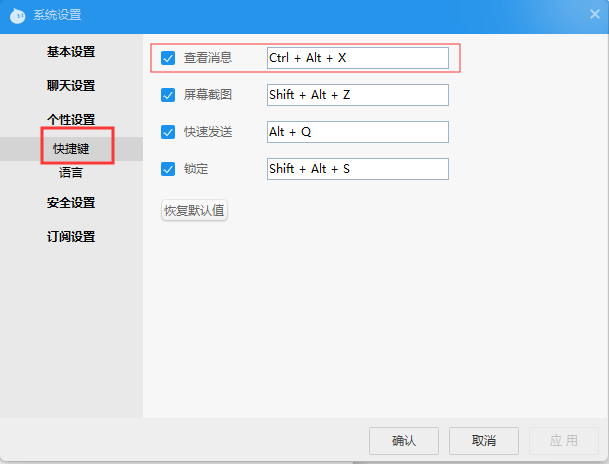

# 收款助手安装

## 1.操作系统配置
a.尽量使用闲置或操作很少的电脑，避免收款助手出现异常，电脑配置不用太高；
b.电脑缩放必须是100%（电脑桌面右键 -> 显示设置）
 

 

---

## 2.安装最新的谷歌chrome浏览器
A.谷歌chrome官方安装（可能需要翻墙）；
https://www.google.cn/intl/zh-CN/chrome/
B.通过腾讯电脑管家或360软件商店安装；
C.百度搜索
必须保证chrome的版本是v78以上
 

 

---

## 3.安装阿里旺旺
https://alimarket.taobao.com/markets/qnww/portal-group/ww/download

---

## 4.配置旺旺
A.“记住密码”，“自动登录”
 

B.登录后进入系统设置
 

C.常规设置
 

D.个性设置 -> 快捷键， 查看消息必须是Ctrl + Alt + X，其余的随意
 

---

## 5.安装收款助手
[下载软件](https://github.com/chainbank9/usdt_helper/releases)
 
收款助手，无需安装，直接运行exe文件，32位系统运行main-x86.exe，64位系统运行main-x64.exe。
杀毒软件可能会误杀，请添加到杀毒软件可信任区。
